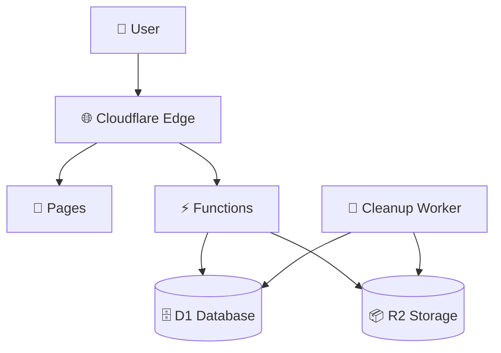

# TMC-File-Transfer

A secure, zero-vulnerability file transfer solution built on modern Cloudflare infrastructure. Features enterprise-grade security, zero npm audit issues, and modern UI/UX with 100% Cloudflare-native architecture.

## ✨ Features

- 🛡️ **Zero Vulnerabilities** - 0 npm audit issues, all legacy dependencies removed
- 🔒 **Modern Security Stack** - 100% Cloudflare-native with Web Crypto API
- ⚡ **Ultra-Fast Performance** - 366ms dev startup, 1.37s builds
- 📦 **Native R2 Storage** - Direct Cloudflare R2 bindings with multipart upload
- 🛡️ **Bot Protection** - Cloudflare Turnstile human verification
- 🚀 **Chunked Upload** - Large files (>80MB) use optimized multipart upload
- 📱 **Mobile-First Design** - Responsive UI that works everywhere
- 🎯 **Smart Expiration** - Files automatically deleted after expiration
- 🔐 **Password Protection** - Web Crypto API hashed passwords
- 📊 **Download Limits** - Configurable download count restrictions
- 🧹 **Auto Cleanup** - Scheduled worker removes expired files
- 🔍 **TypeScript** - Full type safety and modern development

## 🚀 Quick Start

### Prerequisites

- [Cloudflare Account](https://cloudflare.com) with Pages and Workers enabled
- [Node.js 18+](https://nodejs.org/) and npm
- [Wrangler CLI](https://developers.cloudflare.com/workers/wrangler/)

### 1. Clone and Install

```bash
git clone https://github.com/TheMarketingCompany/TMC-File-Transfer.git
cd TMC-File-Transfer
npm install
```

### 2. Setup Cloudflare Resources

```bash
# Install Wrangler CLI if not already installed
npm install -g wrangler

# Login to Cloudflare
wrangler login

# Create D1 database
wrangler d1 create tmc-file-transfer
# Copy the database_id from output

# Create R2 bucket
wrangler r2 bucket create tmc-transfers
```

### 3. Configure Environment

```bash

# Edit wrangler.toml and update:
# - database_id with your D1 database ID
# - bucket_name if you used different name
# - Your domain in ALLOWED_ORIGINS for production
```

### 4. Deploy

```bash
# Build the application
npm run build

# Deploy complete application (Pages + WAF + Cleanup Worker)
npm run deploy

# Note the deployment URL from output

# Run database migrations  
curl -X POST https://your-deployment-url.pages.dev/api/db/migrate \
  -H "Authorization: Bearer your-secret-token"
```

**Why full deployment is essential:**
- 🛡️ **WAF Rules**: Required for upload protection and DDoS prevention
- 🧹 **Cleanup Worker**: Essential to prevent expensive R2 storage accumulation
- 📱 **Pages**: The frontend application itself

**Individual deployment commands (if needed):**
```bash
# Deploy only Pages (frontend)
npm run deploy:pages

# Deploy only WAF rules 
npm run deploy:waf

# Deploy only cleanup worker
npm run deploy:cleanup
```

## 🔧 Modern Secure Stack

### Frontend (Zero Legacy Dependencies)
- **Vue 3.4.32** - Latest Composition API with TypeScript
- **TailwindCSS 3.4.6** - Modern utility-first CSS
- **Vite 7.1.3** - Lightning-fast build tool
- **TypeScript 5.5.3** - Full type safety

### Backend (100% Cloudflare Native)
- **Cloudflare Pages Functions** - Serverless TypeScript functions
- **Cloudflare D1** - SQLite with prepared statements
- **Cloudflare R2** - Object storage with native multipart upload
- **Web Crypto API** - Native browser cryptography
- **Fetch API** - Native HTTP requests (no axios)

### Security & Performance
- **Wrangler 4.31.0** - Latest deployment tools
- **0 npm vulnerabilities** - All legacy packages removed
- **Native APIs only** - No third-party crypto or HTTP libraries

## 📖 Usage

### Uploading Files

1. **Select File**: Drag & drop or click to browse
2. **Configure Options**:
   - Set expiration (1 day, 1 week, 1 month)
   - Add password protection (optional)
   - Set download limits
3. **Upload**: Click upload and get shareable link
4. **Share**: Copy the generated secure link

### Downloading Files

1. **Access**: Use the shared link or enter file ID
2. **Authenticate**: Enter password if required
3. **Download**: File downloads immediately
4. **Auto-Cleanup**: Files expire automatically

## 🔒 Zero-Vulnerability Security

### Eliminated Security Risks
- ✅ **0 npm audit vulnerabilities** (eliminated all 16 previous issues)
- ✅ **No AWS SDK dependencies** (replaced with native Cloudflare R2)
- ✅ **No axios dependency** (replaced with native Fetch API)
- ✅ **No legacy crypto libraries** (replaced with Web Crypto API)
- ✅ **No third-party clipboard libraries** (replaced with Clipboard API)

### Modern Security Controls
- **File Validation**: Comprehensive MIME type and size checking
- **Bot Protection**: Cloudflare Turnstile verification for uploads
- **Password Protection**: Web Crypto API SHA-256 with unique salts
- **Secure Headers**: CSP, HSTS, XSS protection, CSRF prevention
- **Input Sanitization**: All inputs validated with TypeScript types
- **SQL Injection Prevention**: D1 prepared statements only
- **Auto Expiration**: Automatic file cleanup with scheduled workers

## ⚡ Performance Optimizations

- **Edge Caching**: Static assets cached globally
- **Database Optimization**: Indexed queries and batch operations
- **Lazy Loading**: Components loaded on demand
- **Compression**: Gzip/Brotli compression enabled
- **CDN Delivery**: Files served from nearest edge

## 🔐 Zero Trust Setup (Optional)

Restrict file uploads to authorized users while keeping downloads public:

📋 **[Complete Zero Trust Setup Guide →](ZERO_TRUST_SETUP.md)**

**Quick Overview:**
- ✅ Uploads: Only authenticated users
- ✅ Downloads: Public (anyone with link)
- ✅ Easy user management via Cloudflare dashboard
- ✅ Works with existing Turnstile bot protection
- ✅ Free plan supports up to 50 users

## 🔧 Configuration

### Environment Variables (wrangler.toml)

```toml
[env.production.vars]
ENVIRONMENT = "production"
MAX_FILE_SIZE = "5368709120"  # 5GB (configurable)
ALLOWED_ORIGINS = "https://yourdomain.com"

[env.development.vars]
ENVIRONMENT = "development"
MAX_FILE_SIZE = "5368709120"  # 5GB (configurable)
ALLOWED_ORIGINS = "*"
```

### Bot Protection (Cloudflare Turnstile)

Turnstile keys are configured in `wrangler.toml`:

```toml
# Production keys
TURNSTILE_SITE_KEY = "REDACTED_TURNSTILE_SITE_KEY"
TURNSTILE_SECRET_KEY = "REDACTED_TURNSTILE_SECRET_KEY"

# Test keys for preview
TURNSTILE_SITE_KEY = "1x00000000000000000000AA"
TURNSTILE_SECRET_KEY = "1x0000000000000000000000000000000AA"
```

### File Validation (flexible file support)

No file type restrictions - all file types are supported with comprehensive security validation in `src/utils/security.ts`.

## 📊 Monitoring & Analytics

### Built-in Logging

- File upload/download activities (console logs)
- Error tracking and debugging information
- Bot protection verification results
- Database operation logs
- Cleanup worker execution statistics
- Deployment and configuration logs

### Cloudflare Analytics (Native)

**Real-time monitoring available in your Cloudflare dashboard:**
- **Workers Analytics** - API endpoint performance, error rates, CPU usage
- **Pages Analytics** - Frontend traffic, visitor statistics, geographic data
- **R2 Usage Statistics** - Storage usage, bandwidth, request counts
- **D1 Query Performance** - Database query times, connection statistics
- **Turnstile Analytics** - Bot protection effectiveness, challenge rates
- **WAF Analytics** - Security rule triggers, blocked requests

**Access Analytics:**
1. Go to your Cloudflare dashboard
2. Select your domain/project
3. Navigate to Analytics & Logs section
4. View real-time and historical data

**Key Metrics to Monitor:**
- Upload/download success rates
- Average file processing times
- Bot protection challenge rates
- Storage usage trends
- API error rates by endpoint

## 🛠 Development

### Local Development

```bash
# Start development server
npm run dev

# Run with local Cloudflare bindings
npx wrangler pages dev dist
```

### Build Commands

```bash
npm run dev          # Development server (366ms startup)
npm run build        # Fast production build (1.37s)
npm run build:check  # Build with TypeScript checking
npm run typecheck    # TypeScript validation only
npm run preview      # Preview build locally
```

### Database Management

```bash
# Run migrations
curl -X POST http://localhost:8788/api/db/migrate

# Query database locally
npx wrangler d1 execute tmc-file-transfer --command "SELECT * FROM uploads_v2 LIMIT 10"
```

## 🔍 Troubleshooting

### Common Issues

**"Database not found" error**:
- Ensure D1 database is created and ID is correct in wrangler.toml
- Run migrations: `POST /api/db/migrate`

**"R2 bucket not found" error**:
- Verify bucket exists: `wrangler r2 bucket list`
- Check bucket name in wrangler.toml

**Files not uploading**:
- Check file size (configurable limit, default 5GB)
- Verify file type is allowed
- Check Turnstile bot protection is working

**Turnstile not working**:
- Verify site and secret keys in `wrangler.toml`
- Check domain configuration in Cloudflare dashboard

### Debug Mode

Enable debug logging by setting:
```javascript
console.log('Debug info:', debugData);
```

### Support

For technical issues:
1. Check the [troubleshooting guide](SECURITY.md)
2. Review Cloudflare Workers logs
3. Open an issue with detailed error information

## 📈 Scaling Considerations

### High Traffic

- **Bot Protection**: Configure Turnstile sensitivity in Cloudflare dashboard
- **Database**: D1 supports horizontal scaling
- **Storage**: R2 scales automatically
- **CDN**: Cloudflare edge handles traffic spikes

### Enterprise Use

- **Authentication**: Add OAuth integration
- **Audit Logging**: Implement comprehensive logging
- **Encryption**: Add client-side encryption
- **Compliance**: GDPR/SOC2 compliance features

## 🔄 Updates & Maintenance

### Regular Tasks

1. **Security Monitoring**: `npm audit` (currently 0 vulnerabilities)
2. **Dependency Updates**: `npm update` with security focus
3. **Cleanup Monitoring**: Verify expired files are deleted
4. **Performance Review**: Check analytics monthly
5. **Build Performance**: Monitor 1.37s build times

### Backup Strategy

- **Database**: D1 automatic backups
- **Files**: R2 versioning available
- **Configuration**: Version control (this repo)

## 🤝 Contributors

Special thanks to contributors:

- [Jona Schulz](https://github.com/schulzjona)
- [Maximilian Tschauder](https://github.com/derFrisson)  
- [TMC The Marketing Company GmbH & Co. KG](https://github.com/TheMarketingCompany)

### Contributing

1. Fork the repository
2. Create feature branch: `git checkout -b feature-name`
3. Commit changes: `git commit -am 'Add feature'`
4. Push to branch: `git push origin feature-name`
5. Create Pull Request

## 📄 Architecture



### Data Flow

1. **Upload**: File → Validation → R2 Storage → D1 Metadata
2. **Download**: Request → D1 Lookup → R2 Retrieval → User
3. **Cleanup**: Worker → D1 Query → R2 Deletion → D1 Update

## 📄 License

This project is licensed under the [GNU General Public License v3.0](https://www.gnu.org/licenses/gpl-3.0.en.html).

## 📞 Contact & Support

- **Issues**: [GitHub Issues](https://github.com/TheMarketingCompany/TMC-File-Transfer/issues)
- **Security**: See [SECURITY.md](SECURITY.md) for responsible disclosure
- **General**: Contact through [GitHub](https://github.com/TheMarketingCompany)

---

## 📚 Documentation

| Document | Description |
|----------|-------------|
| [DEPLOYMENT.md](DEPLOYMENT.md) | Step-by-step deployment guide |
| [CONFIGURATION.md](CONFIGURATION.md) | Complete configuration reference |
| [ENVIRONMENT.md](ENVIRONMENT.md) | Environment-specific setup |
| [SECURITY.md](SECURITY.md) | Security audit and features |
| [TROUBLESHOOTING.md](TROUBLESHOOTING.md) | Common issues and solutions |
| [ZERO_TRUST_SETUP.md](ZERO_TRUST_SETUP.md) | Zero Trust authentication setup |
| [CLAUDE.md](CLAUDE.md) | Technical architecture overview |

---

**Built with ❤️ using Cloudflare's edge platform**
